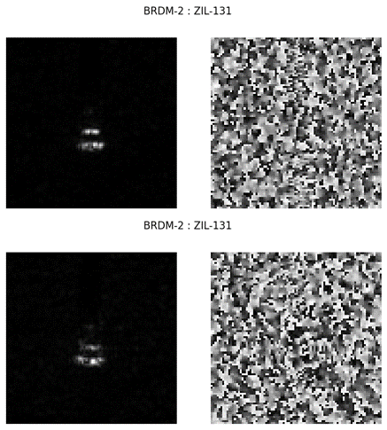
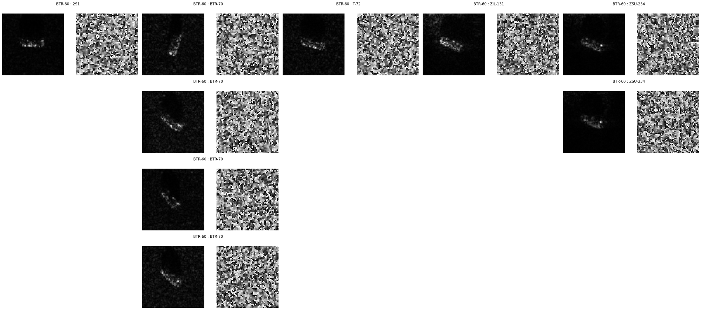
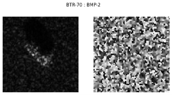
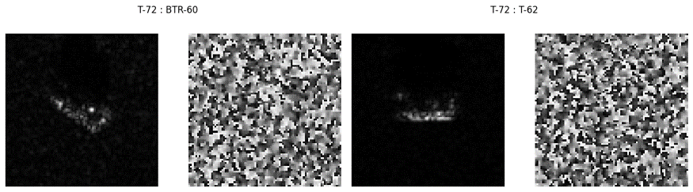
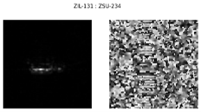

# A-ConvNets

**Note:**
>
> Since this is my first trial to implement a model with SAR images and I don't have any domain knowledge,
> this repository may contains weird implementations.
>
> If you find those kinds of incorrect things, please let me know to correct it via issues. 
>
> It will be very helpful for me to understand SAR image processing and could contribute to lower the technical barriers.
>
> Thank you.

## Target Classification Using the Deep Convolutional Networks for SAR images

This repository contains the implementation of the paper 
`S. Chen, H. Wang, F. Xu and Y. Jin, "Target Classification Using the Deep Convolutional Networks for SAR Images,"
 in IEEE Transactions on Geoscience and Remote Sensing, vol. 54, no. 8, pp. 4806-4817, Aug. 2016,
 doi: 10.1109/TGRS.2016.2551720.` 


## MSTAR Dataset

The implementation uses MSTAR(Moving and Stationary Target Acquisition and Recognition) database. Each of image consists of
header(ASCII type) and data(*data type: float32, shape: W X H X 2*). Header contains meta data to read and utilize the
database which include width, height, serial number, azimuth angle, etc. Data consists of magnitude and phase. Below
figure is the example of magnitude(left) and phase(right).


In order to comprehensively assess the performance, the model is trained and evaluated under SOC
(Standard Operating Condition) which uses the images captured at 17 depression angle for training and uses the images
captured at 15 depression angle for evaluation.

|Class|Serial No.|Training<br/>Depression<br>angle|Training<br/>#images|Test<br/>Depression<br>angle|Test<br/>#images|
|:---:|:---:|:---:|:---:|:---:|:---:|
2S1 | b01 | 17 | 299 | 15 | 274 |
BMP-2 | 9563 |17 | 233 | 15 | 195 |    
BRDM-2 | E-71 | 17 | 298 | 15 | 274 |
BTR-60 | k10yt7532 |17 | 256 | 15 | 195 |   
BTR-70 | c71 | 17 | 233 | 15 | 196 |
D7 | 92v13015 | 17 | 299 | 15 | 274 |
T-62 | A51 | 17 | 299 | 15 | 273 |
T-72 | 132 | 17 | 232 | 15 | 196 |
ZIL-131 | E12 | 17 | 299 | 15 | 274 |
ZSU-234 | d08 | 17 | 299 | 15 | 274 |

## Model

#### `src/model/network.py`

Because of lack of lack of the number of available data in MSTAR database, deep neural networks could be suffered from
over fitting. Hence, the author proposes new architecture which eases the over fitting problem by replacing fully
connected layers with convolution layers.

|layer|Input|Conv 1|Conv 2|Conv 3|Conv 4|Conv 5|
|:---:|---|:---:|:---:|:---:|:---:|:---:|
|channels|2|16|32|64|128|10|
|weight size| - |5 x 5|5 x 5|6 x 6|5 x 5| 3 x 3|
|pooling| - | 2 x 2 - s2 | 2 x 2 - s2 |  2 x 2 - s2| - | - |
|dropout| - | - | - | - | 0.5 | - |
|activation| linear | ReLU | ReLU | ReLU | ReLU | Softmax |

## Experiments

### Data Augmentation

#### `src/data/generate.py`
#### `src/data/mstar.py`

This repository follows the shifting method which used by author. However in order to preserve the reproducibility this
repository doesn't uses the random sampling to extract patches. The patches are extracted in raster scanning order using
patch size and stride.

### Training

#### `src/model/_base.py`

#### `experiments/AConvNet.json`

To replicate the official result, the model is trained with same optimization methods which uses SGD with Momentum,
learning rate decay, weight decay, and the weights are initialized with He's method with uniform distribution.

The difference with the paper is the author decreases the learning rate at epoch 50, but this repository decreases the
learning at 10 and 50 for stable convergence for my environments. 


### Early Stopping

The early stopping method is a form of regularization technique that finds the balance point between under fitting and
over fitting.

In this experiments, the trained model shows an accuracy 99.01% at epoch 42.

### Results

#### Confusion Matrix

| classes | 2S1 | BMP-2 | BRDM-2 | BTR-60 | BTR-70 | D7 | T-62 | T-72 | ZIL-131 | ZSU-234 | Accuracy |
|:---:|:---:|:---:|:---:|:---:|:---:|:---:|:---:|:---:|:---:|:---:|:---:|
| 2S1 | 274 | 0 | 0 | 0 | 0 | 0 | 0 | 0 | 0 | 0 | 100 |
| BMP-2 | 1 | 190 | 0 | 2 | 0 | 0 | 0 | 2 | 0 | 0 | 97.44 |
| BRDM-2 | 0 | 0 | 272 | 0 | 0 | 0 | 0 | 0 | 2 | 0 | 99.27 |
| BTR-60 | 1 | 0 | 0 | 186 | 4 | 0 | 0 | 1 | 1 | 2 | 95.38 |
| BTR-70 | 0 | 1 | 0 | 0 | 195 | 0 | 0 | 0 | 0 | 0 | 99.49 |
| D7 | 0 | 0 | 0 | 0 | 0 | 272 | 0 | 0 | 2 | 0 | 99.27 |
| T-62 | 0 | 0 | 0 | 0 | 0 | 0 | 271 | 0 | 0 | 2 | 99.27 |
| T-72 | 0 | 0 | 0 | 1 | 0 | 0 | 1 | 194 | 0 | 0 | 98.98 |
| ZIL-131 | 0 | 0 | 0 | 0 | 0 | 0 | 0 | 0 | 273 | 1 | 99.64 |
| ZSU-234 | 0 | 0 | 0 | 0 | 0 | 0 | 0 | 0 | 0 | 274 | 100 |
| Total | - | - | - | - | - | - | - | - | - | - | 99.01|

> The total accuracy is calculated with  (TP + TN) / (TP + TN + FP + FN).
> 
> It is equivalent to sum(C * I) / sum(C).
> 
> Where C is confusion matrix and I is identity matrix

<!-- TODO : reinforce more analytical explanation
#### Error Analysis

False Positive of BMP-2


False Positive of BRDM-2



False Positive of BTR-60



False Positive of BTR-70



False Positive of D7


False Positive of T-62


False Positive of T-72



False Positive of ZIL-131


-->

#### Outlier Rejection

> TODO

### Details about the Specific environment of this repository

|||
|:---:|:---:|
| OS | Windows 10| 
| CPU | Intel i9 |
| GPU | RTX 2080 8GB |
| Memory | 16 GB |
| SSD | 500GB |
| HDD | 2TB |

### Citation

```
@ARTICLE{7460942,
  author={S. {Chen} and H. {Wang} and F. {Xu} and Y. {Jin}},
  journal={IEEE Transactions on Geoscience and Remote Sensing}, 
  title={Target Classification Using the Deep Convolutional Networks for SAR Images}, 
  year={2016},
  volume={54},
  number={8},
  pages={4806-4817},
  doi={10.1109/TGRS.2016.2551720}
}
```