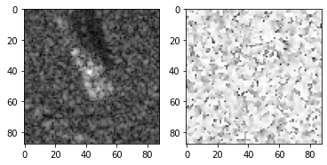
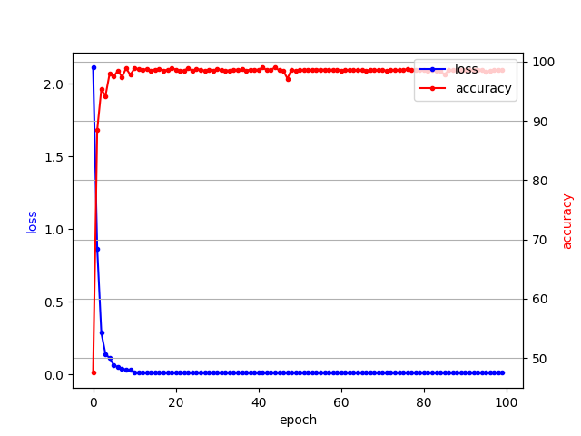

# A-ConvNets

**Note:**
> 
> Since this is my first trial to implement a model with SAR images and I don't have any domain knowledge, 
> this repository may contains weird implementations. 
>
> If you find those kinds of incorrect implementation, please let me know to correct it. 
>
> It will be very helpful for me to understand SAR image processing. 
>
> Thank you.

## Target Classification Using the Deep Convolutional Networks for SAR images
 
This repository contains the implementation of the paper

>  S. Chen, H. Wang, F. Xu and Y. Jin, "Target Classification Using the Deep Convolutional Networks for SAR Images," 
> in IEEE Transactions on Geoscience and Remote Sensing, vol. 54, no. 8, pp. 4806-4817, Aug. 2016, 
> doi: 10.1109/TGRS.2016.2551720.

<!--
The purpose of this implementation is to reproduce the accuracy(99.13%) of the model under the condition of **SOC** 
and replicate some Tables and Figures which is attached in `IV. Experiments` section.
-->

## MSTAR Dataset

The implementation  MSTAR(Moving and Stationary Target Acquisition and Recognition) database. Each of image consists of
header(ASCII type) and data(*data type: float32, shape: W X H X 2*). Header contains meta data to read and utilize the database which include 
width, height, serial number, azimuth angle, etc. Data consists of magnitude and phase. Below figure is the example of 
magnitude(left) and phase(right).

In order to comprehensively assess the performance, the model is trained and evaluated under SOC
(Standard Operating Condition) which uses the images captured at 17 depression angle for training 
and uses the images captured at 15 depression angle for evaluation.    

|Class|Serial No.|Training Depression angle|Training #images|Test Depression angle|Test #images|
|:---:|:---:|:---:|:---:|:---:|:---:|
2S1 |  b01 | 17 | 233 | 15 | 196 |
BMP-2 | 9563 |17 | 233 | 15 | 196 |    
BRDM-2 | E-71 | 17 | 233 | 15 | 196 |
BTR-60 | k10yt7532 |17 | 233 | 15 | 195 |   
BTR-70 | c71 | 17 | 233 | 15 | 274 |
D7 | 92v13015 | 17 | 233 | 15 | 274 |
T-62 | A51 | 17 | 233 | 15 | 274 |
T-72 | 132 | 17 | 233 | 15 | 273 |
ZIL-131 | E12 | 17 | 233 | 15 | 274 |
ZSU-234 | d08 | 17 | 233 | 15 | 274 |

## Model
#### `src/model/network.py`
Because of lack of lack of the number of available data in MSTAR database, deep neural networks could be suffered from
over fitting. Hence, the author proposes new architecture which eases the over fitting problem by replacing fully connected
layers with convolution layers.

|layer|Input|Conv 1|Conv 2|Conv 3|Conv 4|Conv 5|
|:---:|---|:---:|:---:|:---:|:---:|:---:|
|channels|2|16|32|64|128|10|
|weight size| - |5 x 5|5 x 5|6 x 6|5 x 5| 3 x 3|
|pooling| - | 2 x 2 - s2 | 2 x 2 - s2 |  2 x 2 - s2| - | - |
|dropout| - | - | - | - | 0.5 | - |
|activation| linear | ReLU | ReLU | ReLU | ReLU | Softmax |
 

## Experiments
### Data Augmentation
#### `src/data/generate.py`
#### `src/data/mstar.py`
This repository follows the shifting method which used by author. However in order to preserve the reproducibility this 
repository doesn't uses the random sampling to extract patches.
The patches are extracted in raster scanning order using patch size and stride.

### Training 
#### `src/model/_base.py`
#### `experiments/AConvNet.json`

To replicate the official result, the model is trained with same optimization mechanisms which uses SGD with Momentum,
learning rate decay, weight decay and the weights are initialized with He's method with uniform distribution.

The difference with the paper is the author decreases the learning rate at epoch 50, but this repository decreases the learning
at 10 and 50 for stable convergence for my environments. 

### Early Stopping

The early stopping method is a form of regularization technique that finds the balance point between under fitting and over fitting.

In this experiments, we achiveve tha accuracy 99.01% at epoch 42.

### Results
#### Confusion Matrix
TODO

#### Error Analysis
TODO

#### Outlier Rejection
TODO

### Details about the Specific environment of this repository
|||
|:---:|:---:|
| OS | Windows 10| 
| CPU | Intel i9 |
| GPU | RTX 2080 8GB |
| Memory | 16 GB |
| SSD | 500GB |
| HDD | 2TB |
